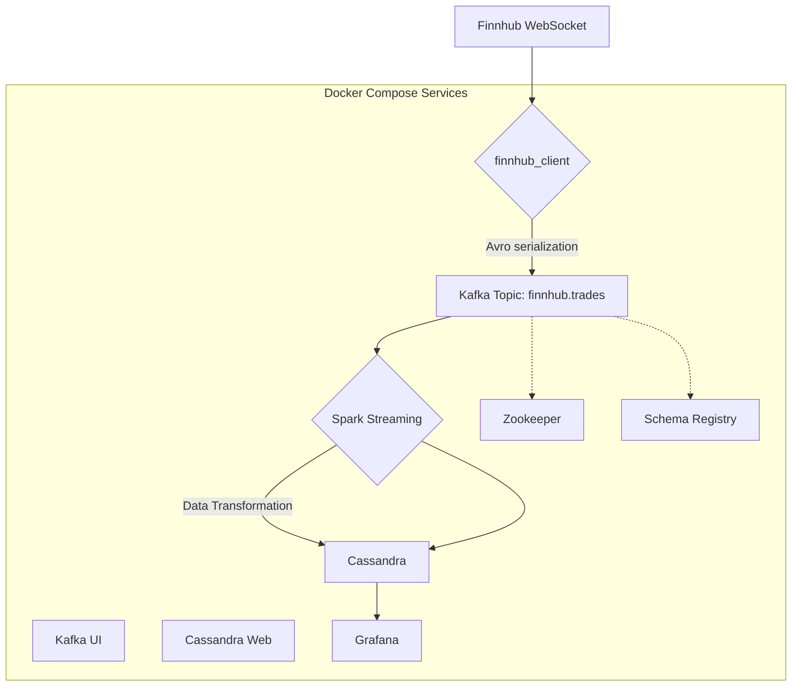

# 📊 Real-Time Data-Engineering-Project Finnhub

[](https://www.python.org/)
[](https://kafka.apache.org/)
[](https://spark.apache.org/)
[](https://cassandra.apache.org/)
[](https://www.docker.com/)
[](https://opensource.org/licenses/MIT)

This project is a real-time data engineering pipeline that streams financial data from the Finnhub API, processes it using Apache Spark, and stores it in Apache Cassandra. The entire pipeline is containerized using Docker Compose for easy setup and deployment.

## 🏛️ Architecture

The architecture of this project is designed to be scalable, resilient, and maintainable. It follows a classic streaming data pipeline pattern.



### Data Flow

1.  **Data Ingestion**: The `finnhub_client` service connects to the Finnhub WebSocket API to receive real-time trade data for various cryptocurrency symbols.
2.  **Message Queuing**: The ingested data is serialized into Avro format and published to a Kafka topic named `finnhub.trades`. Avro schemas are managed by the Confluent Schema Registry.
3.  **Stream Processing**: An Apache Spark Streaming job consumes the data from the Kafka topic. It deserializes the Avro messages, transforms the data by renaming columns, adding timestamps, and generating a unique ID for each trade.
4.  **Data Storage**: The processed data is then written to an Apache Cassandra database for long-term storage and fast retrieval.
5.  **Monitoring & UI**: The stack includes several tools for monitoring and management:
    *   **Kafka UI**: For browsing Kafka topics and messages.
    *   **Cassandra Web**: For querying and managing the Cassandra database.
    *   **Grafana**: For visualizing data and monitoring the pipeline (dashboards need to be configured).

## ✨ Features

-   **Real-Time Data Streaming**: Ingests live financial data from Finnhub.
-   **Scalable Processing**: Uses Apache Spark for distributed stream processing.
-   **Efficient Serialization**: Employs Avro for efficient data serialization with schema evolution support.
-   **Resilient Storage**: Stores data in Apache Cassandra, a highly available and scalable NoSQL database.
-   **Containerized**: Fully containerized with Docker Compose for easy setup and portability.
-   **Monitoring**: Includes tools for monitoring and managing the pipeline.

## 🚀 Getting Started

### Prerequisites

-   [Docker](https://www.docker.com/get-started) and Docker Compose
-   A Finnhub API token. You can get one for free from [finnhub.io](https://finnhub.io/).

### Installation

1.  **Clone the repository:**
    ```bash
    git clone https://github.com/your-username/data_pipeline_streaming_finnhub.git
    cd data_pipeline_streaming_finnhub
    ```

2.  **Create an environment file:**
    Create a `.env` file in the root of the project and add your Finnhub API token and other configurations:
    ```env
    # Finnhub
    FINNHUB_TOKEN=your_finnhub_api_token

    # Kafka
    KAFKA_BOOTSTRAP_SERVERS=broker:29092
    KAFKA_TOPIC=finnhub.trades
    SCHEMA_PATH=./scripts/schemas/trades.avsc

    # Cassandra
    CASSANDRA_HOST=cassandra
    CASSANDRA_PORT=9042
    CASSANDRA_USER=cassandra
    CASSANDRA_PASSWORD=cassandra
    CASSANDRA_KEYSPACE=finnhub
    CASSANDRA_TABLE=trades
    CASSANDRA_CLUSTER_NAME=MyCluster
    CASSANDRA_DC=dc1
    CASSANDRA_RACK=rack1
    CASSANDRA_BROADCAST_ADDRESS=172.19.0.10
    CASSANDRA_LISTEN_ADDRESS=auto

    # Grafana
    GRAFANA_ADMIN_USER=admin
    GRAFANA_ADMIN_PASSWORD=admin
    ```

### Usage

1.  **Start the pipeline:**
    ```bash
    docker-compose up -d
    ```

2.  **Check the logs:**
    You can check the logs of any service to ensure it's running correctly:
    ```bash
    docker-compose logs -f python_app
    docker-compose logs -f spark-master
    ```

3.  **Access the UIs:**
    -   **Kafka UI**: [http://localhost:8080](http://localhost:8080)
    -   **Cassandra Web**: [http://localhost:3002](http://localhost:3002)
    -   **Grafana**: [http://localhost:3000](http://localhost:3000)
    -   **Spark Master UI**: [http://localhost:8090](http://localhost:8090)


4.  **Stop the pipeline:**
    ```bash
    docker-compose down
    ```

## 📁 Project Structure

```
.
├── docker-compose.yml      # Docker Compose configuration for all services
├── dockerfile              # Dockerfile for the Finnhub client
├── README.md               # This file
├── requirements.txt        # Python dependencies for the client
├── setup.py                # Python project setup
└── src
    ├── casandra
    │   └── casandra-setup.cql # Cassandra keyspace and table schema
    ├── finnhub_client.py   # Main application for data ingestion
    ├── kafka_consumer.py   # (Not used in the main flow) Example consumer
    ├── main.py             # Entrypoint for the Finnhub client
    ├── processor
    │   ├── Dockerfile      # Dockerfile for the Spark processor
    │   └── src
    │       ├── schemas
    │       │   └── trades.avsc # Avro schema for trade data
    │       └── stream_processor.py # Spark Streaming application
    ├── schema
    │   └── trades.avsc     # Avro schema (used by producer)
    ├── utils
    │   ├── avro_utils.py   # Avro serialization utilities
    │   ├── kafka_producer.py # Kafka producer utility
    │   └── rate_limiter.py # (Not actively used) Rate limiter utility
    └── websocket
        └── finnhub_websocket.py # WebSocket client for Finnhub
```

## 📝 License

This project is licensed under the MIT License - see the [LICENSE](LICENSE) file for details.
